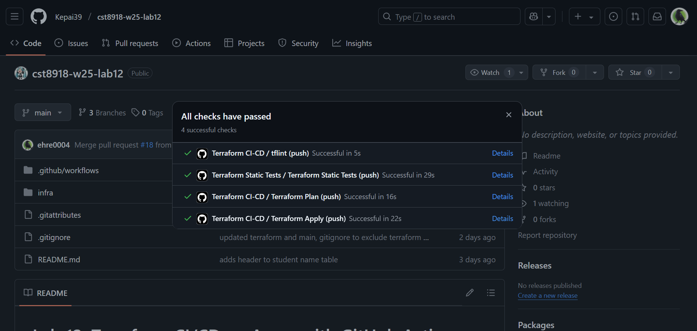
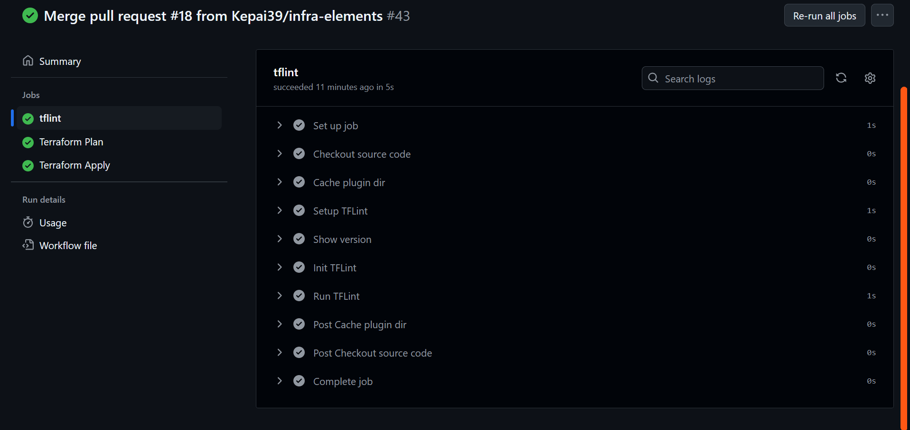
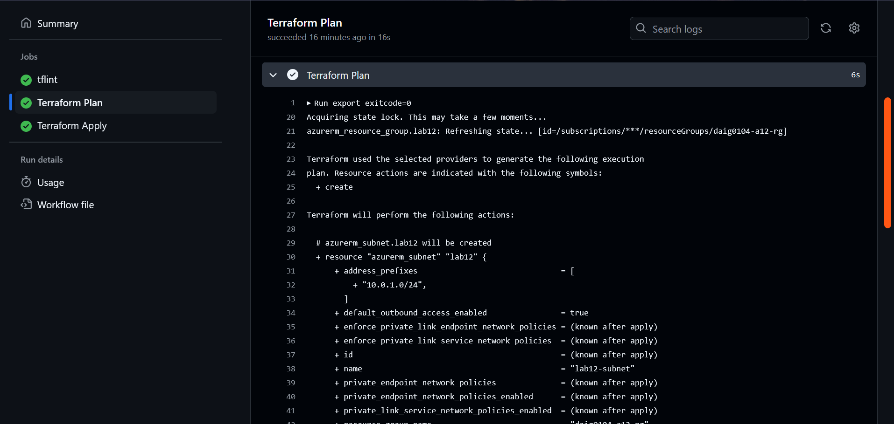
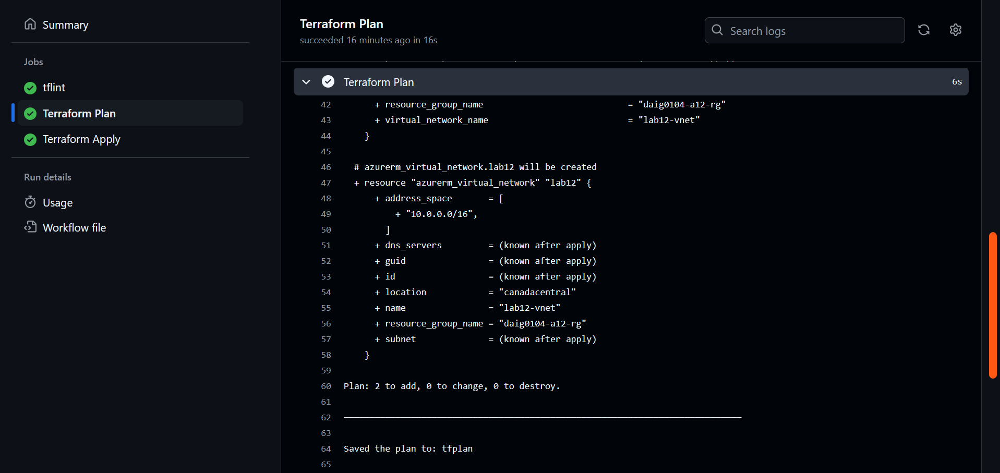
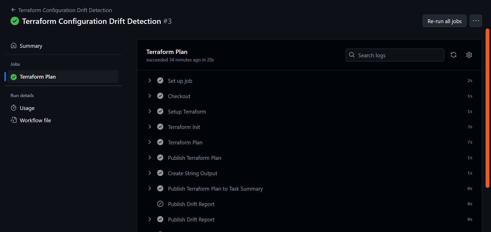
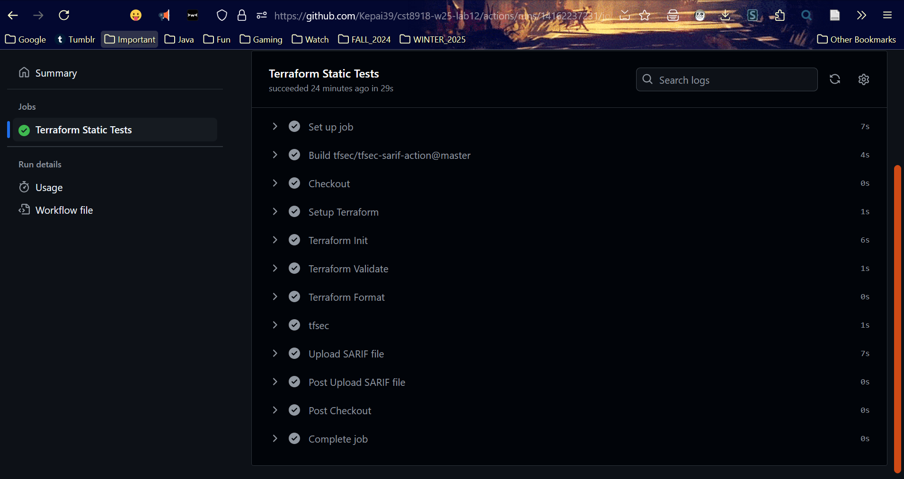

# Lab 12: Terraform CI/CD on Azure with GitHub Actions

## Students

| Name             | Student ID | Github Account  |
| ---------------- | ---------- | --------------- |
| Catherine Daigle | 41175118   | Kepai39         |
| Rae Ehret        | 040907812  | ehre0004        |

## Screenshots

### Pull Request showing workflow success

>Merge pull request #18 from Kepai39/infra-elements
>
>adds vnet and subnet resources

All checks have passed:

All the steps (CI-CD):

### Pull request showing Terraform plan step

Part 1 (CI-CD):

Part 2 (CI-CD):

### Terraform Configuration Drift Detection

### Terraform Static Tests

